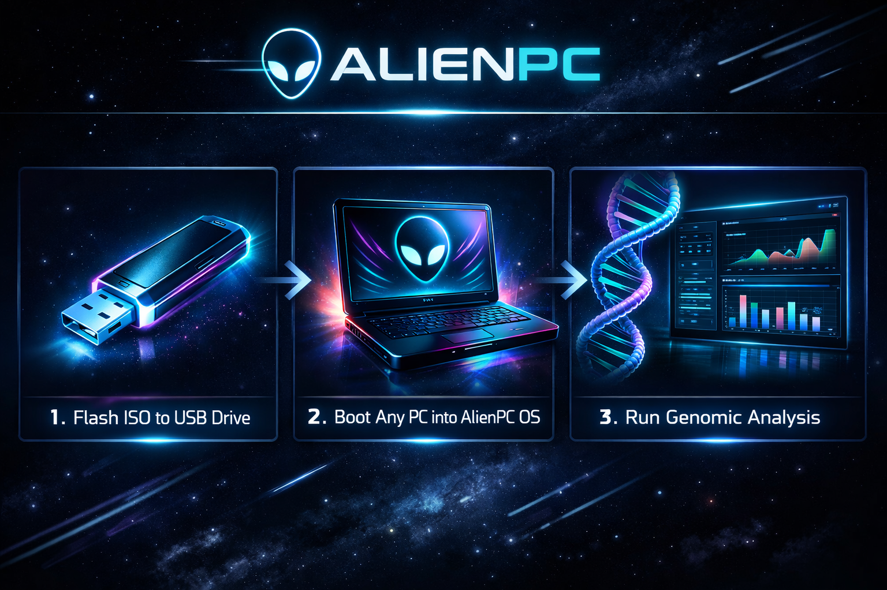

# 👽 AlienPC

AlienPC is a portable Linux-based operating system designed for flexibility and legacy hardware revival. It features a sovereign-grade genomic insight engine for decoding complex genomic signatures.



## Core Attributes
- **Debian Linux Distribution**
- **Portable Execution** via USB/SD/E-SATA
- **No Installation Required**
- **Hardware Adaptability** (minimal to high-spec PCs)
- **Free Open Source Applications**
- **64-bit Architecture Support**
- **RAM Range:** 1GB–4GB
- **Clonable & Redistributable Images**
- **Legacy PC Revitalization**
- **Minimal Footprint Execution**

## Quick Start Reference
```bash
# Download and verify:
curl -LO https://github.com/onegayunicorn/AlienPC/releases/latest/download/AlienPC.iso
curl -LO https://github.com/onegayunicorn/AlienPC/releases/latest/download/AlienPC.iso.sha256
sha256sum -c AlienPC.iso.sha256
gpg --verify AlienPC.iso.asc AlienPC.iso

# Flash to USB (Replace /dev/sdX with your actual device):
sudo dd if=AlienPC.iso of=/dev/sdX bs=4M status=progress && sync

# Boot, launch browser to localhost:8080, run synthetic base detection!
```

## Project Structure
- `docs/`: Documentation, rituals, and specifications.
- `boot/`: Bootloader configurations and early-boot scripts.
- `os/`: Minimal Debian-based root filesystem.
- `apps/`: Bundled open-source applications.
- `genomics/`: Sovereign-grade genomic insight engine.
- `assets/`: Visual and audio assets.
- `CI/`: Build pipelines and packaging helpers.

## Getting Started
Refer to `docs/attributes.md` and `docs/invocation_scroll.md` for more details on the project's philosophy and usage.
